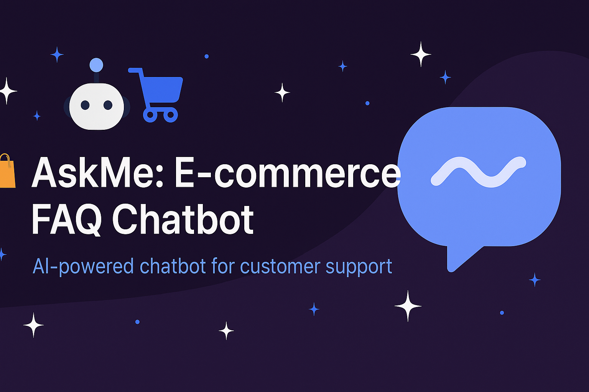

# 🛍️ AskMe: E-commerce FAQ Chatbot

An AI-powered chatbot built using **Streamlit** and **SentenceTransformer** that answers frequently asked questions (FAQs) about an e-commerce service.

---

## 📌 Features

- ✅ Real-time question answering
- 💡 Suggested sample FAQs for quick help
- 📜 Chat history memory
- 🧹 Clear Chat button
- 📞 Contact Support fallback
- 👍👎 Thumbs Up/Down feedback

---

## 🤖 How It Works

- User inputs a question via text.
- The chatbot uses SentenceTransformer embeddings to find the most similar FAQ question.
- If a confident match is found, the bot responds with the relevant answer.
- Otherwise, it suggests related questions with answers.

---

## 🔧 Tech Stack

- **Frontend**: [Streamlit](https://streamlit.io/)
- **NLP Model**: [`all-MiniLM-L6-v2`](https://huggingface.co/sentence-transformers/all-MiniLM-L6-v2)
- **Backend Logic**: Python
- **Data**: CSV file with pre-defined FAQs

---

## 🚀 Getting Started

### Prerequisites

- Python 3.7+
- pip

### Installation

```bash
git clone https://github.com/yourusername/ecommerce-faq-chatbot.git
cd ecommerce-faq-chatbot
pip install -r requirements.txt

### Run the App
python -m streamlit run app.py

## 📁 Project Structure
ecommerce-faq-chatbot/
│
├── app.py                  # Streamlit frontend
├── chatbot.py              # Core logic for question answering
├── faq_data.csv            # Sample FAQ data (questions & answers)
├── requirements.txt        # Required Python packages
└── README.md               # Project overview

## 🙌 Acknowledgements

- [Streamlit](https://streamlit.io/)
- [SentenceTransformers](https://www.sbert.net/)
- [Hugging Face](https://huggingface.co/)

---

## 📄 License

This project is licensed under the **MIT License**.

